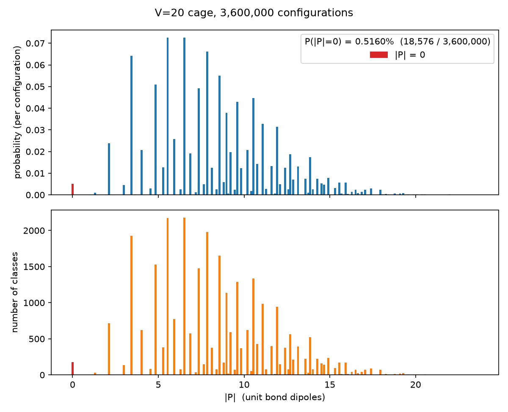

# 5^12 ケージ（正12面体）の水素結合配置の網羅的列挙：結果まとめ

## 1. 問題設定

- 包接水和物の 5^12 ケージを、頂点（酸素）20 個、辺（水素結合）30 本の 3 正則グラフとして扱う。
- 各辺の向き（ドナーからアクセプターへ）を 1 ビットで表すので、向き付けは全部で 2^30 ≈ 10.7 億通りある。
- アイスルール：各水分子のケージ内の 3 本の結合について、in:out を 2:1 または 1:2 に限る（3 本とも同じ向きは禁止）。4 本目の結合はケージの外を向き、その向きはケージ内の 3 本から自動的に決まる。
- 対称性：配置を、ケージグラフの自己同型群で移り合うかどうかで同値類（以下「クラス」）に分ける。自己同型群は正12面体の点群と同じになる。
  - Ih（位数 120）：鏡映と反転を含む。鏡像体どうしは同じクラスとみなす。
  - I（位数 60）：回転のみ。鏡像体どうしは別のクラスとして区別する。
- クラスの縮重度は、そのクラスに属する配置の数で、\(|G| / |\mathrm{Stab}|\) に等しい。ここで Stab は、その配置を変えない対称操作のなす部分群（安定化群）。

## 2. 主な結果

| 量 | 値 |
|---|---|
| アイスルールを満たす配置の総数 | **3,600,000** |
| Ih で区別したクラス数 | **30,026** |
| I で区別したクラス数 | **60,016** |
| ダングリング OH をもつ水分子の数（どの配置でも同じ） | 10 |
| 分極 P = 0 になる配置の数と確率 | **18,576**（**0.516%**）、176 クラス（7 節） |
| 平均の分極の大きさ \|P\| | 8.38（結合 1 本の双極子を 1 とする単位、7 節） |

ダングリング OH の行は、グラフの形から必ずそうなる。ケージ内でドナーが 1 本の水分子の数を \(n_1\)、2 本の水分子の数を \(n_2\) とすると、\(n_1 + n_2 = 20\) と \(n_1 + 2n_2 = 30\)（ドナーの総数は辺の本数に等しい）が成り立つので、\(n_1 = n_2 = 10\) となる。ダングリング OH をもつのは \(n_1\) 個の水分子である。

### 2.1 Ih（位数 120）でのクラスの内訳

| 安定化群 | 位数 | 縮重度 | クラス数 | 配置数 |
|---|---|---|---|---|
| C1 | 1 | 120 | 29,982 | 3,597,840 |
| Ci（反転 i のみ） | 2 | 60 | 32 | 1,920 |
| C5 | 5 | 24 | 8 | 192 |
| S10（= C5 × Ci） | 10 | 12 | 4 | 48 |
| 合計 | | | 30,026 | 3,600,000 |

- 99.85% のクラスは対称性をもたない（C1）。
- 鏡映面 σ を含む安定化群（Cs、C5v など）は 1 つも現れない。対称性のある配置は、反転中心か C5 軸、またはその両方をもつものに限られる。
- 鏡映、反転、回映のいずれかを含む安定化群をもつ（アキラルな）クラスは、Ci の 32 個と S10 の 4 個を合わせた 36 個。残りの 29,990 個はキラルである。

### 2.2 I（位数 60、回転のみ）でのクラスの内訳

| 安定化群 | 位数 | 縮重度 | クラス数 | 配置数 |
|---|---|---|---|---|
| C1 | 1 | 60 | 59,996 | 3,599,760 |
| C5 | 5 | 12 | 20 | 240 |
| 合計 | | | 60,016 | 3,600,000 |

### 2.3 Ih と I の関係

Ih の各クラスは、I では次のように分かれる。

- キラルなクラス（29,990 個）は、鏡像体の対として 2 つの I クラスに分かれる。
- アキラルなクラス（36 個）は、I でも 1 つのクラスのままである。

したがって \(2 \times 29{,}990 + 36 = 60{,}016\) となり、I で直接数えた値と一致する。C5 については、Ih の C5 クラス 8 個が 16 個に分かれ、S10 クラス 4 個は C5 クラス 4 個になるので、I の C5 クラスは 20 個になる。

## 3. 方法

高速化の工夫とその効果は [implementation_notes.md](implementation_notes.md) にまとめた。

| 段階 | 内容 | 実装 |
|---|---|---|
| グラフ | 黄金比を使った正12面体の厳密座標から、最短距離の 1.25 倍以内の頂点どうしを結合とみなす | [iceorbit/geometry.py](../iceorbit/geometry.py) |
| 対称性 | 隣接関係が保たれるかどうかで枝刈りしながら、頂点の置換をバックトラックで列挙する。鏡映を含む操作か回転かは、各頂点と隣接 3 頂点が作る行列式の符号で判定する | [iceorbit/symmetry.py](../iceorbit/symmetry.py) |
| 列挙 | 辺を幅優先探索の順に 1 本ずつ決め、3 本の辺がそろった頂点はその場でアイスルールを判定して、違反する途中状態を捨てる（numpy でベクトル化） | [iceorbit/enumerate.py](../iceorbit/enumerate.py) |
| 分類 | 対称操作は「辺の置換と向きの反転」として配置に作用する。辺の置換は 16 ビット単位のルックアップ表で計算する。各配置について全操作の像の最小値を正準形とし、同時に安定化群の位数を数える | [iceorbit/canon.py](../iceorbit/canon.py) |

## 4. 検証

| 検証項目 | 結果 |
|---|---|
| 2^30 通りの総当たりによる総配置数 | 3,600,000（列挙結果と一致） |
| 自己同型群の位数 | 120（うち回転 60） |
| Burnside の補題によるクラス数（各操作で動かない配置数の平均） | Ih で 30,026、I で 60,016（一致） |
| 全クラスで「縮重度 × 安定化群の位数 = 群の位数」 | 成立 |
| 立方体（8 頂点、12 辺）での総当たりとの比較 | 配置 450 通り、Oh で 14 クラス、O で 24 クラス。代表配置と縮重度まで完全に一致 |
| ビット演算による群作用と、頂点置換をそのまま適用した結果 | 一致 |
| 座標を歪ませた xyz ファイル（水素原子を含む）からの読み込み | 同じグラフと群が得られる |

クラス数 30,026 は、McDonald, Ojamäe, Singer (J. Phys. Chem. A, 1998) の (H2O)20 正12面体クラスターについての報告値と一致する。ただし、これは記憶に基づく照合なので、原典で確認する必要がある。総数 3,600,000 は総当たりで確認した。

## 5. 計算時間

Apple Silicon の Mac で、Python 3.14 と numpy 2.5 を使って計測した。

| 処理 | 時間 |
|---|---|
| 自己同型群の計算 | 0.01 秒未満 |
| 配置の列挙（途中の配列は最大 6,273,280 要素） | 約 0.4 秒 |
| Ih での分類（360 万配置 × 120 操作） | 約 2.0 秒 |
| I での分類（360 万配置 × 60 操作） | 約 1.3 秒 |
| 分極の計算（360 万配置） | 約 0.4 秒 |
| 参考：2^30 通りの総当たりによる検証 | 約 47 秒 |

## 6. 出力ファイル

`python -m iceorbit --out results/dodecahedron` を実行すると、次の 4 つのファイルができる。

- `results/dodecahedron_classes.csv`：クラスごとに 1 行。代表配置（正準形の整数値）、ビット列、縮重度、安定化群の位数、鏡映型の操作を含むかどうか（`stabilizer_improper`）、分極の大きさ（`polarization`）を記録する。行は縮重度の大きい順に並ぶ。
- `results/dodecahedron_polarization.csv`：分極の大きさがとる値ごとに 1 行。|P|、|P|²、配置数、確率、クラス数を記録する。
- `results/dodecahedron_polarization.png`：分極の大きさの分布の図（7 節の図と同じ）。
- `results/dodecahedron.npz`：全 360 万配置と各配置のクラス番号、各配置の分極の大きさ、座標、辺リスト、対称操作の一覧（頂点置換と、回転かどうかの判定）。

ビット列の e 文字目は、辺 e = (u, v)（u < v、辺は辞書順に番号付け）の向きを表す。`0` なら u がドナー、`1` なら v がドナー。

## 7. 分極

### 7.1 モデル

- 水素結合 1 本を、ドナーからアクセプターへ向かう大きさ 1 の双極子とみなす。
- ケージ内の 30 本の結合は、辺の方向（単位ベクトル）を向く。
- 各水分子の 4 本目の結合（ケージの外へ出る結合）は、その水分子のケージ内の 3 本の結合の単位ベクトルの和と逆向きにとる。正12面体ではこの向きは重心から頂点へ向かう向きと一致する（テストで確認済み）。14面体などでは一般に一致しないが、同じ定義で計算できる。
- 4 本目の結合の向き（ドナーかアクセプターか）は、ケージ内の結合で決まる。ケージ内で 2 本を受容し 1 本を供与する水分子は、残りの H を外へ供与する。ケージ内で 1 本を受容し 2 本を供与する水分子は、外から 1 本受容する。
- 分極 P は、これら 50 本（ケージ内 30 本と外向き 20 本）の双極子のベクトル和。全体の符号の取り方は |P| に影響しない。

各結合の寄与は辺のビットについて線形なので、P は「定数ベクトル＋各ビット × 定数ベクトル」の形に書ける。8 ビットごとの表を引くだけで計算でき、360 万配置で約 0.4 秒で終わる。

### 7.2 P = 0 になる確率と頻度

| 量 | 値 |
|---|---|
| P = 0 になる配置の数（頻度） | **18,576**（3,600,000 通り中） |
| P = 0 になる確率（全配置が等確率で現れる場合） | **0.516%**（約 194 配置に 1 つ） |
| P = 0 になるクラスの数（Ih） | **176**（30,026 クラス中、0.586%） |
| 最小の非ゼロの \|P\| | 1.3091 |

P = 0 と最小の非ゼロ値の間は 1.3 以上離れているので、数値誤差（10⁻¹⁴ 程度）で判定を誤るおそれはない。

P = 0 になる 176 クラスは、次のように分けられる。

| 安定化群 | 縮重度 | P = 0 のクラス数 | 配置数 | P = 0 になる理由 |
|---|---|---|---|---|
| Ci | 60 | 32（Ci の 32 クラスすべて） | 1,920 | 対称性から必然。反転中心があると P = -P になる |
| S10 | 12 | 4（S10 の 4 クラスすべて） | 48 | 対称性から必然。反転中心を含む |
| C5 | 24 | 2（C5 の 8 クラス中） | 48 | 偶然。C5 軸があると P は軸方向に限られるが、0 である必要はない |
| C1 | 120 | 138（C1 の 29,982 クラス中） | 16,560 | 偶然。対称性はないが、双極子がちょうど打ち消し合う |
| 合計 | | 176 | 18,576 | |

対称性から必然的に P = 0 になる配置は 1,968 通りで、P = 0 の配置全体の約 11% にすぎない。残りの約 89%（16,608 通り）は、対称性をもたない（あるいは C5 軸しかもたない）のに双極子が偶然打ち消し合っている配置である。

C5 の 8 クラスの |P| は、0 が 2 クラス、14.577 が 4 クラス、23.586 が 2 クラスだった。23.586 は全配置の中で最大の |P| であり、最も分極した配置は C5 対称をもつ 2 つのクラス（計 48 配置）である。

### 7.3 |P| の分布

|P| がとる値は 80 種類の離散値に限られる。

| 統計量 | 値 |
|---|---|
| 平均 \|P\| | 8.377 |
| ⟨\|P\|²⟩ | 82.10 |
| 中央値 | 7.842 |
| 最大値 | 23.586（48 配置、2 クラス） |
| \|P\| ≤ 5 の確率 | 17.3% |
| \|P\| ≥ 15 の確率 | 3.3% |

\|P\| の小さい側の値：

| \|P\| | 配置数 | 確率 | クラス数 | 累積確率 |
|---|---|---|---|---|
| 0 | 18,576 | 0.516% | 176 | 0.516% |
| 1.3091 | 3,360 | 0.093% | 28 | 0.609% |
| 2.1182 | 85,800 | 2.383% | 715 | 2.993% |
| 2.9956 | 16,080 | 0.447% | 134 | 3.439% |
| 3.4273 | 231,120 | 6.420% | 1,926 | 9.859% |
| 3.6688 | 1,080 | 0.030% | 9 | 9.889% |
| 4.0290 | 74,880 | 2.080% | 624 | 11.969% |
| 4.5519 | 10,320 | 0.287% | 86 | 12.256% |

確率の高い値（上位 8 つ）：

| \|P\| | 配置数 | 確率 | クラス数 |
|---|---|---|---|
| 6.5191 | 261,240 | 7.257% | 2,177 |
| 5.5455 | 261,000 | 7.250% | 2,175 |
| 7.8425 | 237,840 | 6.607% | 1,982 |
| 3.4273 | 231,120 | 6.420% | 1,926 |
| 8.5587 | 198,240 | 5.507% | 1,652 |
| 4.8469 | 183,240 | 5.090% | 1,527 |
| 7.3651 | 176,880 | 4.913% | 1,474 |
| 10.5481 | 160,560 | 4.460% | 1,338 |

全 80 値の表は `results/dodecahedron_polarization.csv` にある。

上段と下段の形がほぼ同じなのは、ほとんどのクラスが縮重度 120 の C1 クラスで、配置数がクラス数のほぼ 120 倍になるためである。

## 8. 今後の拡張の候補

- 5^12 6^2（24 頂点、36 辺）や 5^12 6^4（28 頂点、42 辺）のケージは、xyz ファイルを渡せばそのまま計算できる。ただし、まだ実行していない。配置数が大きく増えるため、メモリと時間の見積もりが必要になる。
- クラス数と縮重度の分布だけが必要なら、Burnside の補題で、各操作で動かない配置の数だけを数えれば済む。
- 代表配置だけを直接生成する方法（orderly generation）を使えば、全配置を作らずに済む。
- 分極以外の物理的な特徴量（ダングリング OH の空間配置、隣接する水分子間の向きの組み合わせなど）を計算する。
