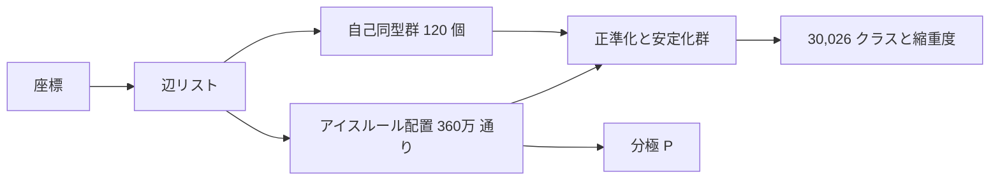

# 実装ノート：速さの理由と設計上の工夫

解析結果は [dodecahedron_results.md](dodecahedron_results.md) にまとめてある。この文書では、コードの側で何を工夫し、それでどれだけ速くなったかを説明する。数値はすべて 12面体ケージ（20 頂点、30 辺、360 万配置）で、Apple Silicon の Mac、Python 3.14、numpy 2.5 を使って計測した。

## 1. 全体像



| 処理 | 本実装 | 素朴な実装 | 速度比 |
|---|---|---|---|
| 配置の列挙 | 0.37 秒（numpy、幅優先で枝刈り） | 47 秒（2^30 通りの総当たり、numpy）<br>13.4 秒（Python の深さ優先探索、同じ枝刈り） | 約 130 倍<br>約 36 倍 |
| 群作用 120 操作 × 360 万配置 | 1.1 秒（16 ビット表） | 13.0 秒（1 ビットずつ移す） | 約 12 倍 |
| 分極 × 360 万配置 | 0.13 秒（8 ビット表） | 約 175 秒（Python で結合を 1 本ずつ足す） | 約 1,300 倍 |
| 自己同型群 | 0.01 秒未満 | | |

`python -m iceorbit` 全体は、起動を含めて約 3 秒で終わる。

## 2. 配置を 1 つの整数で表す

辺 e = (u, v)（u < v）ごとに 1 ビットを割り当て、`0` を u→v、`1` を v→u とする。こうすると、1 つの配置は 30 ビットの整数（uint64）1 個で表せる。この表現にしたことで、次の利点がある。

- 360 万配置が 29 MB の 1 本の numpy 配列に収まる。
- 配置の比較、並べ替え、重複の除去（`np.unique`）が整数の演算で済む。
- 対称操作や分極の計算を、ビット演算と表引きとして配列全体にまとめて適用できる（4 節と 6 節）。

辺は 64 本まで扱える。5^12 6^4 ケージ（42 辺）も 1 つの整数に収まる。

## 3. 列挙：幅優先の展開と早期の枝刈り（[iceorbit/enumerate.py](../iceorbit/enumerate.py)）

総当たりでは 2^30 ≈ 10.7 億通りを作ってから判定するが、本実装では次のようにする。

1. 辺を 1 本ずつ決めていく。途中までの配置をすべて numpy 配列に持ち、新しい辺の 0 と 1 の両方を付け加えて、配列を 2 倍にする。
2. その辺で 3 本の辺がすべて決まった頂点について、アイスルール（入次数が 1 か 2）を配列全体に一括で適用し、違反する途中状態を捨てる。

ルール違反を見つけた時点で、それより先の分岐を一切作らない。各頂点で 8 通りのうち 6 通りしか残らないので、途中の配列は最大でも 627 万要素（約 50 MB）で、10 億には決して届かない。

**辺の順番が重要**。頂点を幅優先探索の順に並べ、「両端の頂点の順位の大きいほう」が小さい辺から先に決める。こうすると、頂点が早い段階で次々と確定し、枝刈りが早く効く。

深さ優先探索（再帰）でも同じ枝刈りはできるが、Python では 1 配置ごとに関数呼び出しが発生するため 13.4 秒かかる。幅優先にすると、1 段の処理がすべて numpy の配列演算になるので、Python のループは 30 回（辺の数）しか回らない。

## 4. 群作用：ビットの置換と XOR、16 ビットの表（[iceorbit/canon.py](../iceorbit/canon.py)）

### 4.1 対称操作をビット演算として書く

頂点の置換 σ を辺に施すと、辺 e は別の辺 π(e) に移る。このとき σ(u) > σ(v) になる辺では、「小さい番号の頂点から大きい番号の頂点へ」という基準の向きが逆になる。そこで、対称操作 g の作用は次のように書ける。

```text
x' = P_g(x) XOR F_g
```

ここで P_g はビットの並べ替え、F_g は向きが逆になる辺のビットを立てた定数（マスク）。向きの反転は XOR 1 回で済む。

### 4.2 ビットの並べ替えを表引きにする

30 ビットを 16 ビットずつに区切り、各区切りについて「16 ビットの値から、並べ替えた後のビット列への表」（65,536 要素）を作っておく。すると P_g(x) は、表を 2 回引いて OR をとるだけで求まる。

| 方法 | 1 操作あたり（360 万配置） | 120 操作 |
|---|---|---|
| 1 ビットずつ移す（30 回のシフトと OR） | 108 ms | 13.0 秒 |
| 8 ビットの表（4 回引く） | 21 ms | 2.5 秒 |
| **16 ビットの表（2 回引く）** | **9.5 ms** | **1.1 秒** |

表は 1 つ 512 KB で CPU キャッシュに収まるので、引く回数が少ないほど速くなる。表は対称操作ごとにその場で作り直す（1 回あたり 65,536 要素の配列演算で、無視できる時間）。

### 4.3 正準形、安定化群、Burnside を 1 回の走査で求める

各配置の正準形を「120 個の像の最小値」と定義する。対称操作を 1 つずつ全配置に施しながら、次の 3 つを同時に更新する。

- 像と現在の最小値を比べて小さいほうを残す（`np.minimum`）。これが最終的に正準形になる。
- 像が元の配置と等しければ、その配置の安定化群の位数に 1 を足す。
- その操作で動かない配置の数を数える（Burnside の補題による検算用）。

最後に `np.unique(canon, return_counts=True)` で、クラスと縮重度が一度に得られる。Python の set や辞書でクラスを管理する必要がない。

## 5. 自己同型群：枝刈りつきバックトラックと局所キラリティ（[iceorbit/symmetry.py](../iceorbit/symmetry.py)）

- **バックトラックの候補を絞る**：頂点を幅優先探索の順に対応づけていく。2 番目以降の頂点の行き先は、その親頂点の行き先の隣接頂点に限られる。3 正則グラフなので、候補は高々 3 つしかない。さらに、すでに対応づけた隣接頂点との整合性を確かめて枝刈りする。外部ライブラリなしで、0.01 秒未満で 120 個の自己同型が求まる。
- **回転か鏡映かの判定**：各頂点 v と、その隣接頂点 a, b, c について、行列式 det(a − v, b − v, c − v) の符号（局所的な右手系か左手系か）を計算する。全頂点でこの符号を保つ置換を回転とみなす。座標を重ね合わせる必要がないので、ケージが多少歪んでいても正しく判定できる。また、符号が頂点ごとにばらばらになった場合はエラーにして、ケージが凸でないなどの異常を検出する。

## 6. 分極：線形性を使った表引き（[iceorbit/polarization.py](../iceorbit/polarization.py)）

分極 P は、ケージ内の結合の符号 s_e = 1 − 2b_e と、外向き結合の符号 t_v = 2·(入次数) − 3 の線形結合である。入次数もビットの和なので、P は次の形に書ける。

```text
P(x) = c + Σ_e b_e w_e
```

定数ベクトル c と、各辺の重みベクトル w_e は、ケージの形だけから前もって計算できる。あとは 30 ビットを 8 ビットずつに区切って「バイトの値から 3 次元ベクトルへの表」を作れば、配置ごとに表を 4 回引いて足すだけで P が求まる。結合を 1 本ずつ足す素朴な計算（約 175 秒）の約 1,300 倍速い（0.13 秒）。

P = 0 の判定には |P| < 10⁻⁸ を使う。12面体では最小の非ゼロ値が 1.309 なので、浮動小数点の誤差（10⁻¹⁴ 程度）とは十分に離れている。

## 7. 結果を自分で検算する仕組み

速さを追求したコードは誤りが入り込みやすいので、計算の中や外に独立な検算を入れている。

- **実行のたびに行う検査**：すべてのクラスで「縮重度 × 安定化群の位数 = 群の位数」が成り立つことを確認し、成り立たなければ例外を出す。Burnside の補題によるクラス数も毎回表示する。
- **テスト**（[tests/](../tests/)、計 12 件、約 8 秒）：
  - 立方体ケージで、総当たりによる配置、クラス、分極と完全に一致する。
  - 16 ビット表による群作用と、頂点置換を 1 本ずつ施す参照実装の結果が一致する。
  - 表引きによる分極と、結合を 1 本ずつ足す参照実装の結果が一致する。
  - 同じクラスに属する配置の |P| がすべて等しい（|P| が対称操作で変わらない）。
  - 座標を歪ませた xyz ファイルからでも、同じグラフと群が得られる。
- **一度だけ行った検算**：2^30 通りの総当たり（47 秒）で、総配置数 3,600,000 を確認した。

## 8. 大きなケージへの拡張と限界

本実装は全配置を一度メモリに並べる方式なので、配置数がメモリに収まる範囲でしか使えない。配置数のおおまかな見積もりは \(2^E \times (3/4)^V\) である（12面体では 340 万と見積もられ、実際の 360 万に近い）。

| ケージ | V | E | 配置数の見積もり | uint64 での配列の大きさ | 見通し |
|---|---|---|---|---|---|
| 5^12（12面体） | 20 | 30 | 約 3.4 × 10⁶（実際は 3.6 × 10⁶） | 29 MB | 数秒 |
| 5^12 6^2（14面体） | 24 | 36 | 約 6.9 × 10⁷ | 約 550 MB | 今の方式で可能だが、途中の配列の分だけメモリがさらに必要 |
| 5^12 6^4（16面体） | 28 | 42 | 約 1.4 × 10⁹ | 約 11 GB | 今の方式では厳しい |

5^12 6^4 のような大きなケージでは、次のいずれかの方式に切り替える必要がある。

- **Burnside の補題で数えるだけにする**：各対称操作で動かない配置の数は、転送行列や動的計画法で全配置を作らずに数えられる。クラス数や縮重度の分布はこれで求まる。
- **代表配置だけを直接生成する**（orderly generation）：探索の途中で「正準形になりえない」枝を捨て、各クラスの代表だけを作る。配置数ではなくクラス数に比例するメモリで済む。
- **ブロックに分けて処理する**：最初の数本の辺の向きで配置を分け、ブロックごとに列挙、正準化、集計を行う。今のコードの延長で実装しやすい。

さらに速くしたい場合は、群作用のループを numba などでコンパイルすると、表引きと最小値の更新を 1 回のループにまとめられるので、数倍程度の高速化が見込める。

## 9. ファイル構成

| ファイル | 役割 |
|---|---|
| [iceorbit/geometry.py](../iceorbit/geometry.py) | 組込みの座標（12面体、立方体）、xyz の読み込み、距離による辺の構築 |
| [iceorbit/symmetry.py](../iceorbit/symmetry.py) | 自己同型の列挙、回転か鏡映かの判定、辺の置換と反転マスク |
| [iceorbit/enumerate.py](../iceorbit/enumerate.py) | アイスルール配置の列挙 |
| [iceorbit/canon.py](../iceorbit/canon.py) | 群作用、正準形、安定化群、クラスへの分類 |
| [iceorbit/polarization.py](../iceorbit/polarization.py) | 分極の計算と、\|P\| の分布の集計 |
| [iceorbit/plot.py](../iceorbit/plot.py) | 分布の図 |
| [iceorbit/\_\_main\_\_.py](../iceorbit/__main__.py) | コマンドラインのインターフェース（`python -m iceorbit`） |
